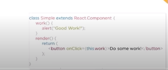
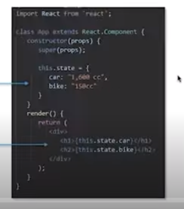
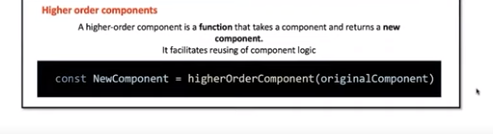
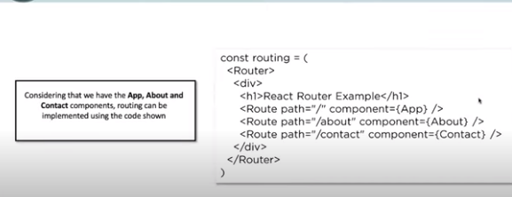
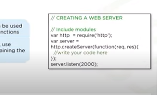
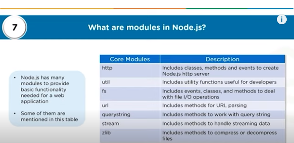

## 1 What is Jsx?
- it is a syntax extension to JavaScript.It is used with react to describe what the user interface should look like. 
- By using this you can write HTML structures in the same file that contains javascript code.
- It helps in making the code easier to understand and debug as it avoid usage of JS DOM structures which are rather complex

## 2 what is virtual DOM?
- React keeps a lightweight representation of the Real DOM in the memory and that is known as the Virtual DOM.
Manipulating Real DOM is much slower than manipulating virtual DOM,because nothing gets drawn onscreen.

- When ths state of an object changes , virtual DOM changes every time the object changes and then    changes the DOM structure accordingly when the object changes again and then changes the DOM structure accordingly  when the object changes again

## 3 What is the difference between Real DOM and Virtual DOM?
- Real DOM updates slow
- Can directly update HTML
- Creates a new DOM if element updates
- Too much of memory wastage
- No memory wastage
       
       
       

## 4 What are react extensions?
- React Developer Tools is a Chrome DevTools extension for the open-source React JavaScript library. It allows you to inspect the React component hierarchies in the Chrome Developer Tools.
 -React goes beyond simple UI and has many extensions for complete application arhitecture support.
 - It provides server side rendering, routing, and many other features.
 - It supports mobile app development using React Native.
 - Extended with flux and redux, it provides a complete application architecture.

 ## 5 What is an event in React? How do you  create one?
  - An event is an action that can be triggered by a User or any System event like pressing a key,a mouse click etc.

  ## 6 What are  components in ReactJS?
  - Components are the building blocks of any React application and a single app usually consists of multiple components.
  - It splits the user Iterface into independent .reusable pieces that can be processed seperately.
  - A component is essentially a piece of the user interface.
  ## 7 What is a State in React?How do you implement it?
  - A state is an object that stores the values of properties belonging to a component that could change over a period of time.
  - A state can be modified based on the user ation or network  changes.
  -Every time the state of an object changes ,React re-renders the component to the  browser.
  - The state object is initialized in the constructor.
  - the state object can store multiple properties.
  - this.setState() is used to change  the value of the state object.
  - setState () function performs a shallow merge between the new and the previous state.
## 8 What is a state in React?How do you implement it?
- A state holds the data that a component renders on the weppage

- This is how a state is accessed
## 9 What is a High  Order Component and pure component?
- A higher order component is a function that takes a component and returns a new component.
- It facilitates code reuse and logic sharing among different components.
- A pure component is a component that does not re-renders if the state or props of the component has not changed.
- It is a class component that extends React.PureComponent instead of React.Component.
- It is used to improve the performance of the application.

## 10 How do you implement React Routing?
-

### Node.js Interview Questions

## 11 What is Node.js?
- It is an open-source ,cross platform JavaScript run-time environment that executes JavaScript code outside of a browser.
- It is used to build scalable network applications.
- It is perfect for data-intensive real-time applications that run across distributed devices.
- Node.js based on the V8 JavaScript engine of Google Chrome.it is a virtual machine that compiles JavaScript directly into machine code.

## 12 Where can we use Node.js?
- web applications
- Distributed systems
- Network applications

## 13 What do you understand by the term I/O?
- I/O stands for input/output.
- It is the process of transferring data to and from the memory of a computer to the peripheral devices of the computer.
- Every transfer is an output from one device and an input to another device.Medium can be anything like a disk, a keyboard, a screen, a network connection, etc.

## 14 Difference between front-end and back-end development?
- Front-end development is the development of the user interface of a website or web application.
- It is the part of the website that users interact with.
- It typically includes everything that attributes to the visual and interactive aspects of a site.
- HTML, CSS, and JavaScript are the core technologies used in front-end development.

- Back-end development is the development of the server side of a website or web application.
- It constitutes the database, the server, and the application.
-It generally includes a web server that  communicates with a database to serve requests.
- Java, Python, Ruby, and PHP are the core technologies used in back-end development.

## 15 What is NPM/
- NPM stands for Node Package Manager.
- NPM is responsible for managing and sharing packages and modules for JavaScript.
- It provides online repositories for node.js packages/modules which are searchable on search.nodejs.org.
- It is also a command-line utility to interact with said repository that aids in package installation, version management, and dependency management.
- Modules are like JavaScript libraries that you can be used in a Node.js application to include additional functions.
- To include a module, use the require() function with the name of the module.

## 16 What are modules in Node.js?
- 

## 17 Why is Node.js being preferred over other backend technologies like java and  PHP?
- It is relatively faster than other backend technologies.
- Node  package manager has over 50,000 bundies  for at the developers disposal.
- perfect for real-time applications that require a lot of data streaming.
- Better synchronization of code between client and server due to same code base.
- Easy for developers to learn and use as it is a JavaScript libraray.

## 18 what is the difference between Node.js and Angular.js?
- Angular.js is a front-end framework that is used for building single-page applications.
- It is written in JavaScript and maintained by Google.
- Used for building single page client side web applications.
- splits a web application into MVC components.

- Node.js is a server-side environment.
- It is used for building fast and scalable network applications.
-It is written in C, C++, and JavaScript and maintained by Joyent.
-Generates database queries.
