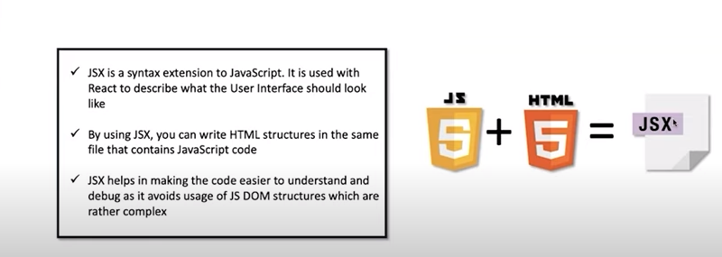
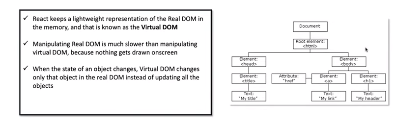
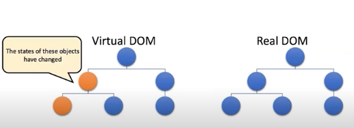
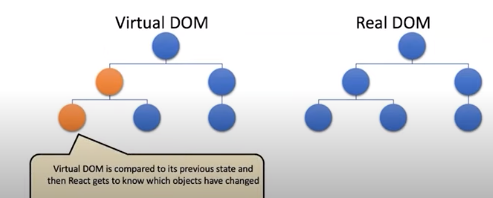
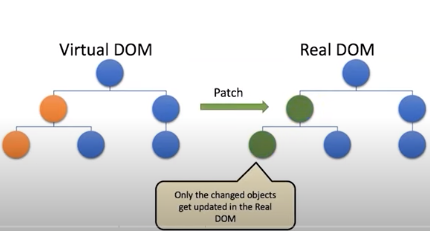

## 1 What is Jsx?
- it is a syntax extension to JavaScript.It is used with react to describe what the user interface should look like. 
- By using this you can write HTML structures in the same file that contains javascript code.
- It helps in making the code easier to understand and debug as it avoid usage of JS DOM structures which are rather complex

## 2 what is virtual DOM?
- React keeps a lightweight representation of the Real DOM in the memory and that is known as the Virtual DOM.
Manipulating Real DOM is much slower than manipulating virtual DOM,because nothing gets drawn onscreen.

- When ths state of an object changes , virtual DOM changes every time the object changes and then    changes the DOM structure accordingly when the object changes again and then changes the DOM structure accordingly  when the object changes again

## 3 What is the difference between Real DOM and Virtual DOM?
- Real DOM updates slow
- Can directly update HTML
- Creates a new DOM if element updates
- Too much of memory wastage
- No memory wastage
       
       
       

## 4 What are react extensions?
- React Developer Tools is a Chrome DevTools extension for the open-source React JavaScript library. It allows you to inspect the React component hierarchies in the Chrome Developer Tools.